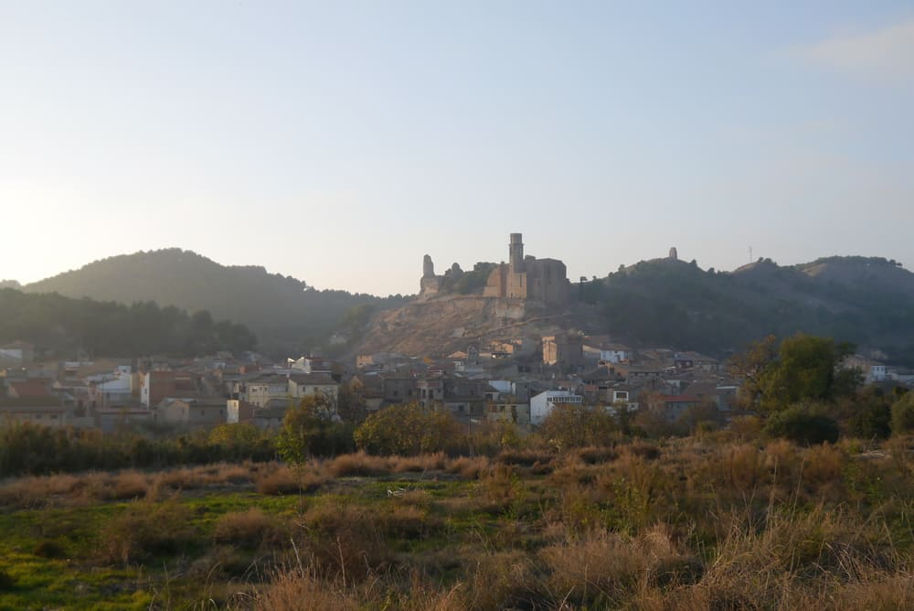
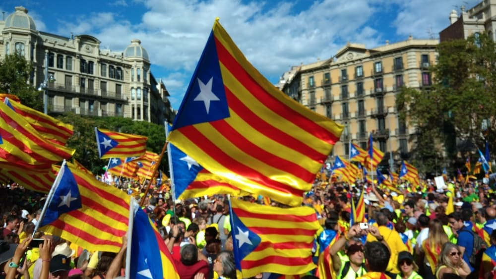
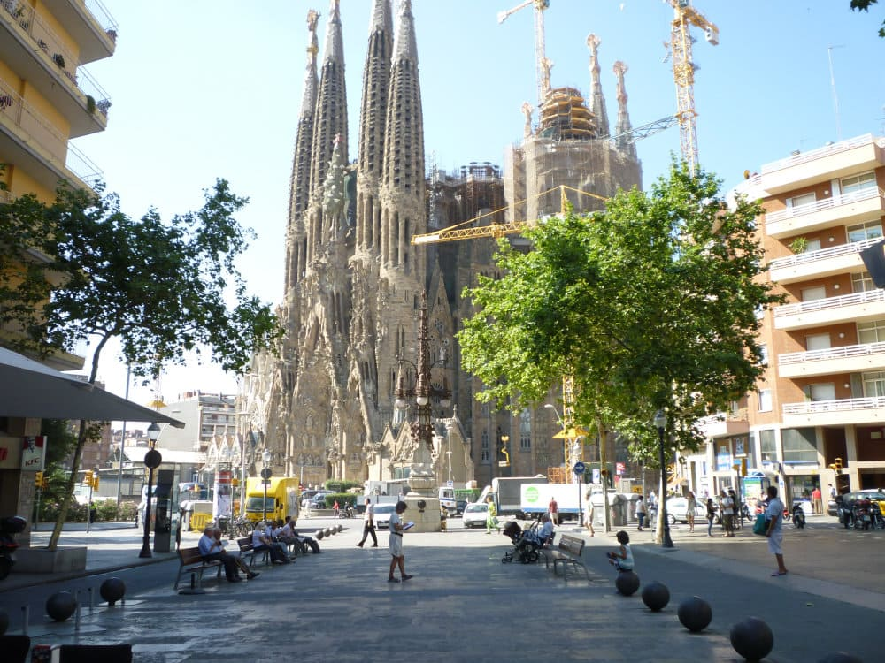

このブログは、筆者の住んでいるバルセロナやカタルーニャについて書こうと思ってます。なので、最初に簡単にカタルーニャを紹介したいと思います。

カタルーニャは、バルセロナを州都とするスペインの 1 つの州です。地中海に面し、北端にはフランスとの国境のピレネー山脈があります。人口は東京の半分強の 750 万人ほど、面積は九州より少し小さい 32,000km2 ほどです。

かつてはスペインとは別の国で、中世には地中海沿いに大きな領土を持つ一大国家を築いていました。しかし、15 世紀の大航海時代の訪れにより経済活動の中心が地中海から大西洋に移ったことで徐々に衰退していきます。そして、18 世紀初頭のスペイン継承戦争の敗北によって完全にスペインに併合されました。

カタルーニャの小さな村、Castelló de Farfanya

## **カタルーニャ人**

私が思うのに、カタルーニャの人々は、「自分はスペイン人ではない、カタルーニャ人だ。」といったアイデンティティを持つ人が多いです。もっと簡単に言ってしまえば、スペインを嫌いな人が多いです。

このことを表す１つのエピソードを紹介します。2018 年、サッカー・ロシア・ワールドカップで、スペイン代表は決勝トーナメント一回戦で敗退しました。私は試合当日、知り合いのカタルーニャ人のマンションでボードゲームをしていたのですが、ゲーム中にスペインの敗退が知らされると、そこにいた全員がテラスに飛び出していきました。私も続いて出てみると、そこには、周囲の建物のあちこちから人々が顔を出し、スペインの敗退を喜び、それを分かち合っている光景がありました。

私の周りのカタルーニャ人は、以上のような人ばかりなのですが、もちろん、スペイン派の人もたくさんいます。また、カタルーニャには多くのスペインからの流入者やその子孫がいますが、彼らのほとんどはスペイン派でしょう。

## **カタルーニャ語**

カタルーニャの公用語はカタルーニャ語とスペイン語です。バルセロナにはたくさんのスペインや中南米からの移住者がいるので、スペイン語をよく耳にしますが、バルセロナ以外では、ほぼカタルーニャ語が使われています。小中高の授業もカタルーニャ語で行われていますし、公共交通機関の放送もカタルーニャ語です。

カタルーニャ語とスペイン語はよく似ています。両方ともローマ帝国の言語であるラテン語から派生した言語だからです。この 2 つの言語的距離を正確に表すことは筆者にはできませんが、あえて言うなら津軽弁と関西弁くらいの違いでしょうか。筆者はカタルーニャ語のクラスを以前とっていたのですが、入門クラスで一緒だったチリ人のクラスメートは、カタルーニャ語の知識はゼロだけど、何を言っているか大体わかると言ってました。

そんなカタルーニャ語ですが、現在、消滅の危機に立たされていると言われています。たくさんの少数言語が大きな言語に呑み込まれていった歴史と同様、スペイン語に取って代わられる危機をカタルーニャの人々は感じています。実際、若い世代の多くは、昔からのカタルーニャ語ではなく、スペイン語化されたカタルーニャ語を話しています。

## **独立運動**

カタルーニャは、18 世紀にスペインに組み込まれて以降、幾度となく独立を試みてきましたが、併合されてから約 300 年が経過した現代においては、独立を求める声は少数派になっていました。そんな折の 2006 年、既に制定されたカタルーニャ自治憲章を、時のスペイン与党、PP（Partido Popular）が違憲であると提訴し、2010 年に憲法裁判所がこれを認める判決をくだしました。このことは、自由と自治を切望する多くのカタルーニャ人の心に火をつけ、独立派を急増させるきっかけとなりました。

2017 年のカタルーニャ・ナショナルデーのバルセロナの中心部。独立を示す星のマークをしつらえた Estelada (エスタラーダ。旗の名前。) が大量にはためく。
 
 

2017 年 10 月、カタルーニャ州政府は、独立するかどうかの住民投票を行いました。これは、スペイン政府非公認のもので、投票日当日には、スペインの警察兼軍隊である Guardia Civil によって暴力を伴った妨害がありました。2017 年 12 月には、[投票結果](https://ja.wikipedia.org/wiki/2017%E5%B9%B4%E3%82%AB%E3%82%BF%E3%83%AB%E3%83%BC%E3%83%8B%E3%83%A3%E7%8B%AC%E7%AB%8B%E4%BD%8F%E6%B0%91%E6%8A%95%E7%A5%A8)に基づき、カタルーニャ州議会は独立宣言を可決し、一応ここで独立が果たされたこととなりました。しかし、結局は一瞬でスペインに力でねじ伏せられ、独立は無かったことになりました。

あれから３年以上が経過した現在、独立に伴う騒乱はあまり表立ってきていません。そのうち、あの激動の時代を振り返り、記事を書いてみたいと思います。

## **観光都市バルセロナ**

バルセロナは海と山に囲まれた、割とこじんまりとしている街です。大都会であるけど、ちょっと歩けば自然もあります。そしてヨーロッパ有数の観光地であり、いたるところ観光客で溢れかえっています。（2021 年 7 月現在、ヨーロッパからの観光客を中心に、徐々に客足が戻りつつあります。）

2010 年くらいのサグラダファミリア。今よりちょっと小さい。
 
 

バルセロナが、現在のような観光地になったきっかけは、1992 年に開催された夏季オリンピックです。火矢で聖火台に点火したあの大会です。（本当は、火矢は聖火台を大きく外れていますが...）このオリンピックの開催をきっかけに、バルセロナは急速に、変貌を遂げていきました。たくさんの移住者と観光客が押し寄せてくるようになり、それに応じて街はどんどん切り拓かれていきました。そして、ほんの 20 年弱で、カタルーニャ人の住む地方都市の１つに過ぎなかった街が、いわゆる人種のるつぼと言っていい国際都市に変貌を遂げました。

観光地は大きな経済的メリットがある反面、様々なデメリットも生み出します。いずれ、バルセロナのツーリズム問題についてもこのブログで取りあげてみたいと思います。（コロナ禍で別の意味の観光問題が生じてしまいましたが...）
