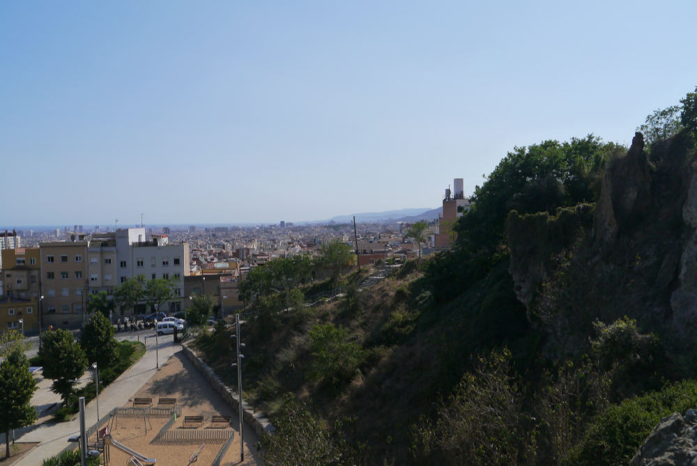
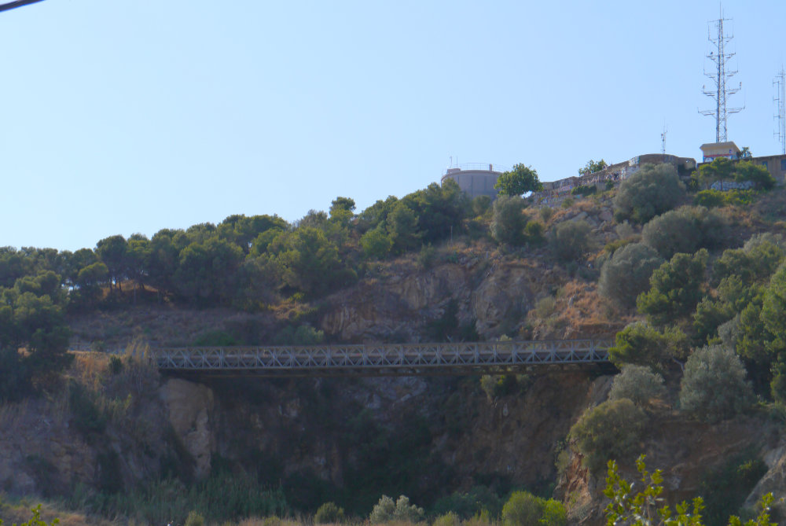
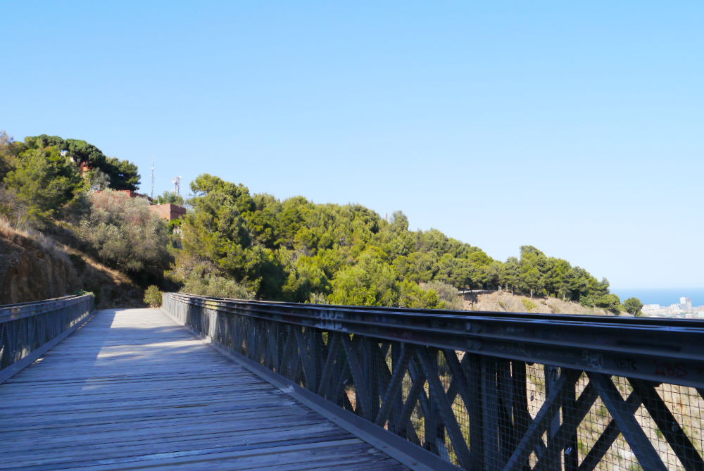
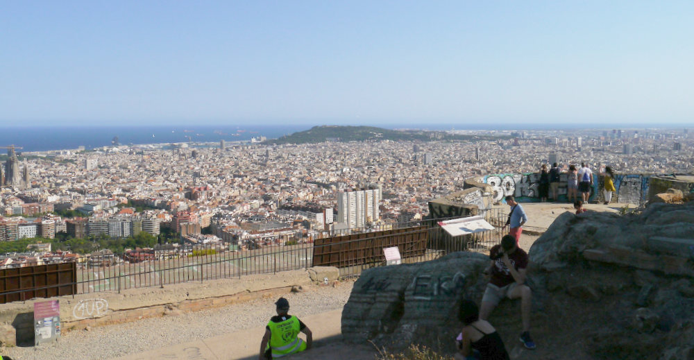
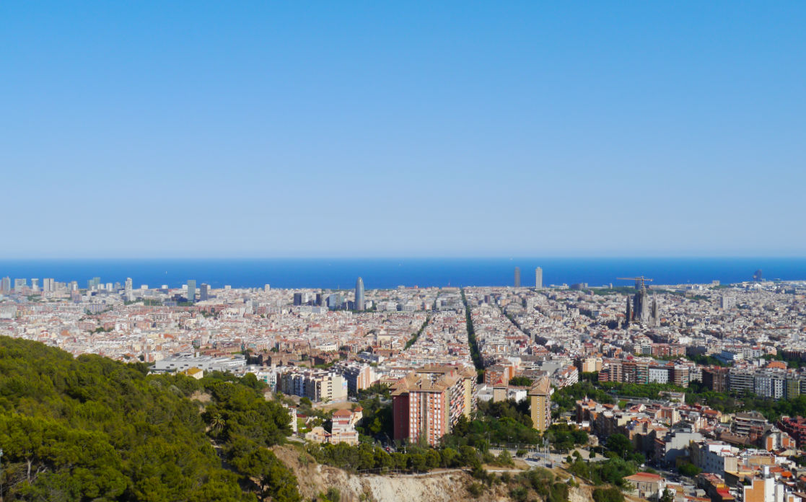
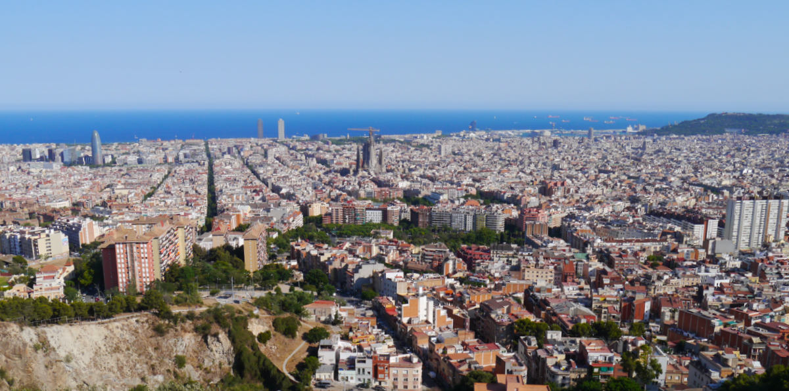

 
 

筆者は 2 日に 1 回くらいの割合で散歩をするのですが、今日は定番の散歩コース、ギナルド公園（Parc del Guinardó）を紹介します。

公園(parc)と言いましたが、実態は小さな山と言った感じで、ちょっとしたハイキング気分が味わえます。また、山頂からはバルセロナ市街が一望でき、この景色を求めて、たくさんの観光客が訪れます。

ギナルド公園（というか小さな山）の入り口の１つです。どの入り口からでも 15 分ほど登れば、山頂の展望台にたどり着きます。
 
 

吊り橋の上に展望台があります。
 
 

上の写真の吊り橋です。
 
 

展望台の様子です。いたるところに落書きがあって、あまり整備されているとは言えません。この日は週末だったのですが、コロナ禍のため、あまり人がいませんでした。（以前は、溢れるほどの観光客がいたものですが。）また、ここは定番の botellón スポット※で、この日もいくつかの若者グループが botellón を楽しんでいました。

※botellón（ボテヨン）は、路上、広場、ビーチ、公園などで行われる酒盛りを意味するスペイン語です。スペインのほとんどの地域で禁止されています。コロナ禍の現在では、バルセロナを含め、高額な罰金が設定されている地域がけっこうあります。
 
 

展望台からの眺めです。地中海とバルセロナ市街が一望できます。
 
 

右端の緑が茂っている場所が、バルセロナオリンピックのメイン会場となったモンジュイックの丘です。中央にはサグラダファミリアが見えます。左端の親指みたいな形をした青い建物は Agbar(アグバル)という名前の高層ビルで、将来バルセロナの経済の中心地になると言われている Les Glóries(グロリアス地区)に位置しています。
