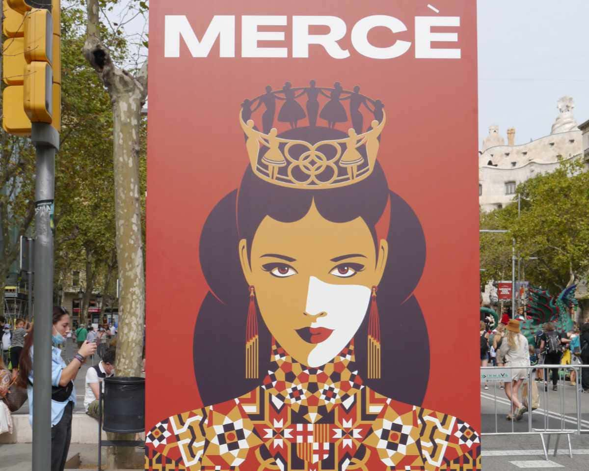
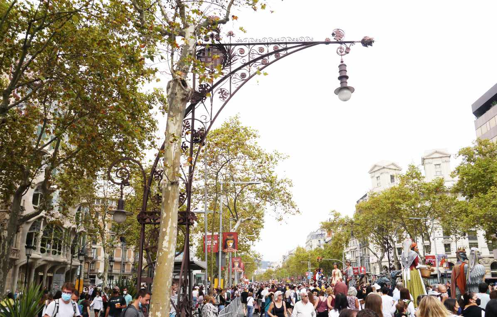
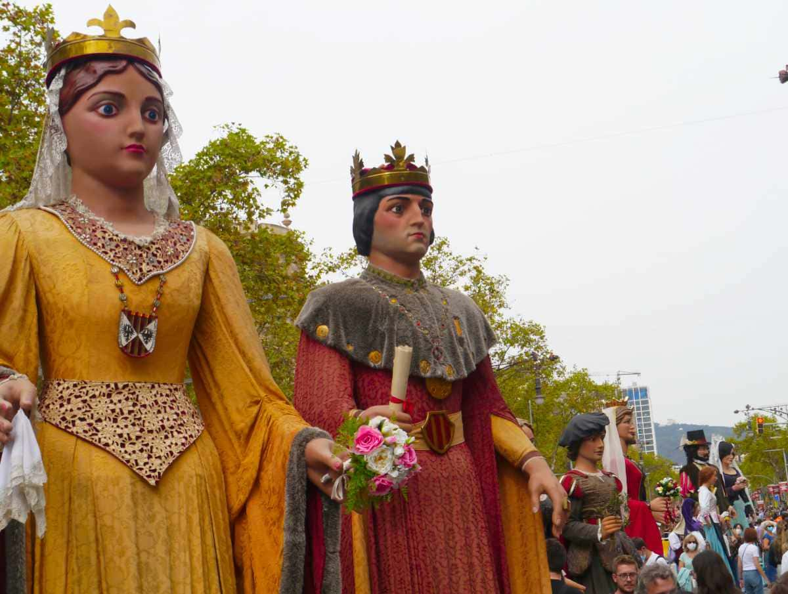
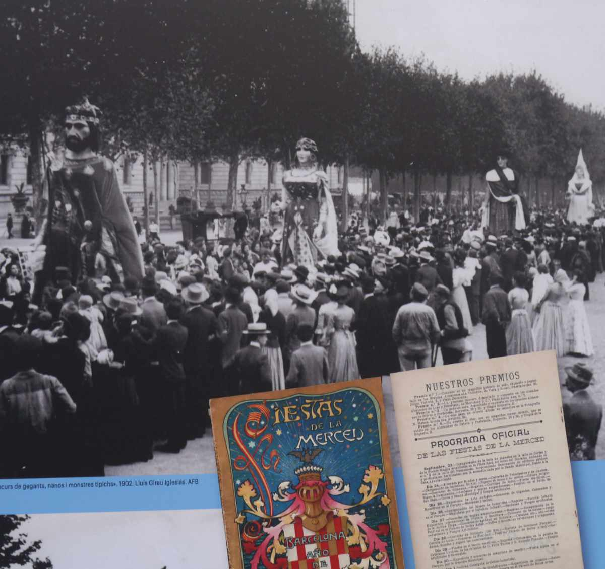
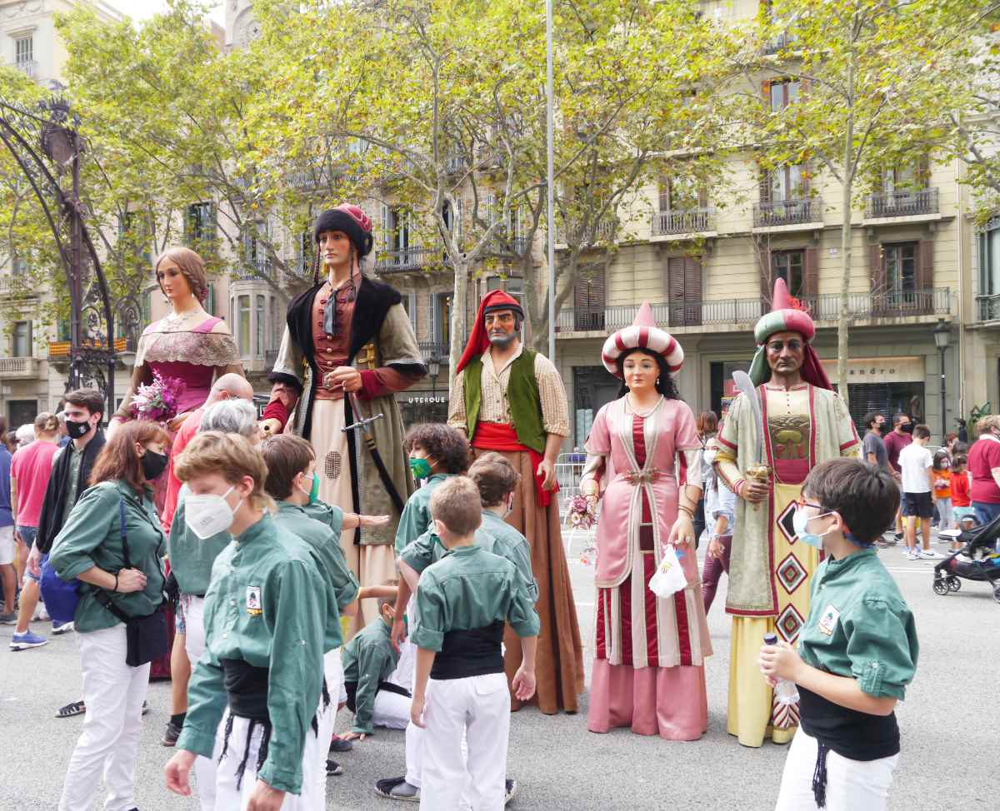
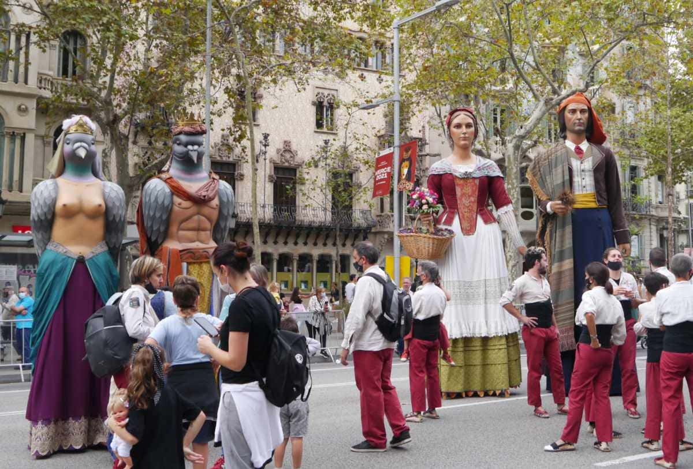
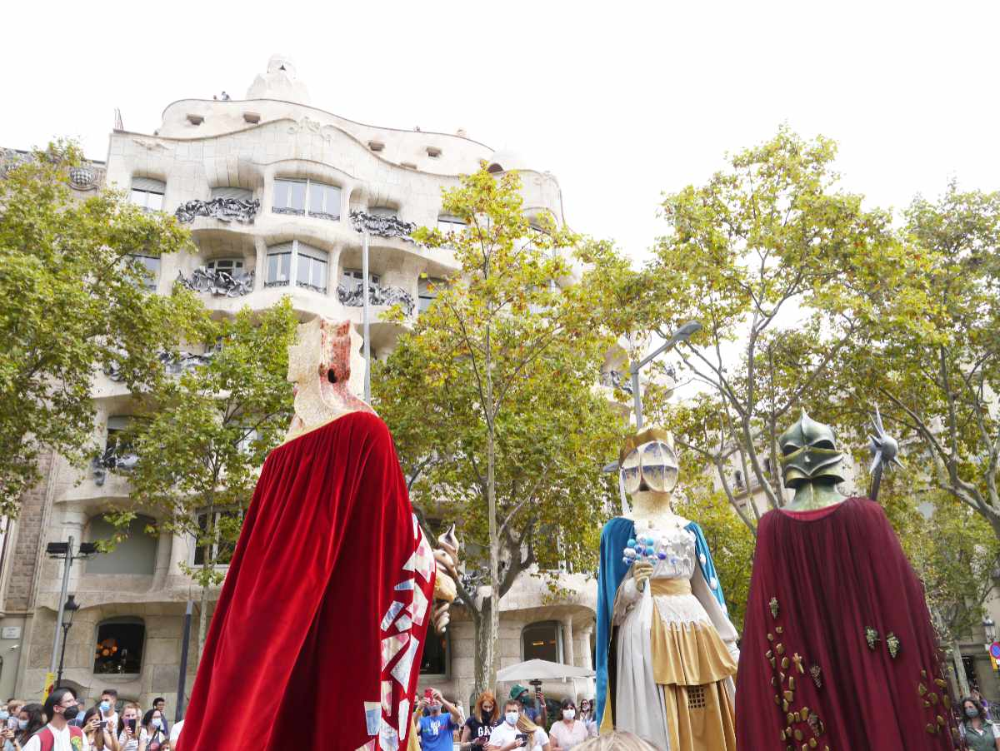
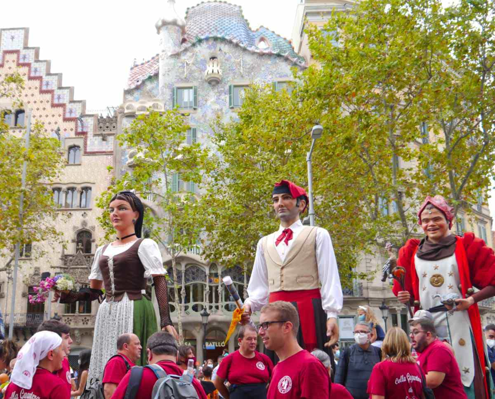
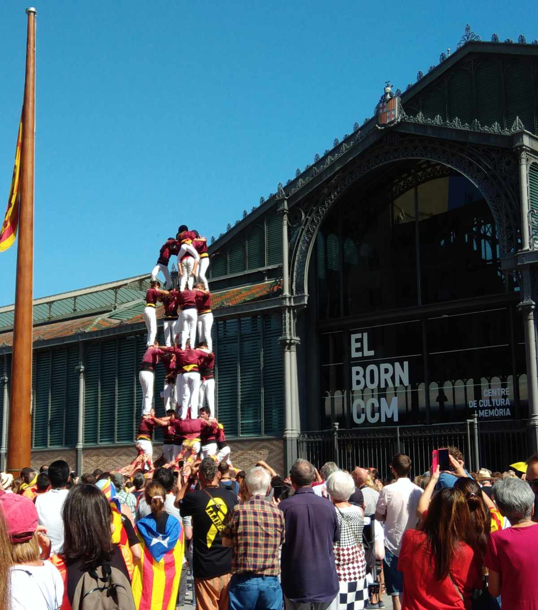
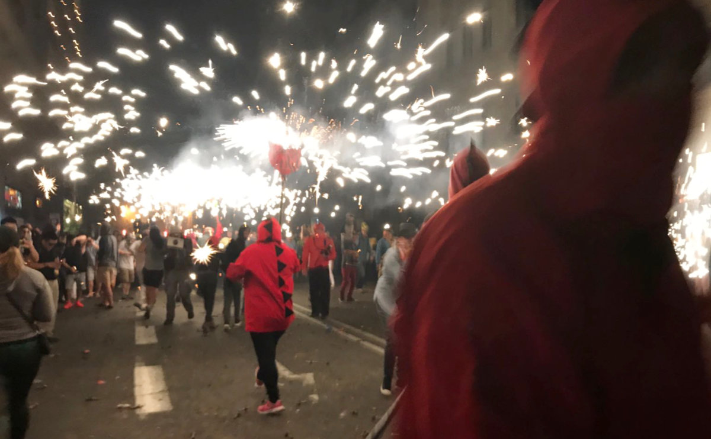

バルセロナの Festa major（街一番のお祭り）である La Mercé（メルセ祭り）が始まったので、見てきました。場所は、街の中心部にある Passeig de Gràcia（パセジ・ダ・グラシア） という通りです。ここは、いわゆる街の目抜き通りで、LOEWE をはじめとする高級ブランドの店舗や、アントニ・ガウディ設計の世界遺産、Casa Milà（カザ・ミラ） や Casa Battló（カザ・バヨ） が軒を連ねています。

 

メルセ祭りの、Passeig de Gràcia（パセジ・ダ・グラシア）の様子です。遠近法により、ものすごい"密"に見えますね。

このメルセ祭りは、巨大都市バルセロナの祭りなだけあって、小さな村の Festa major（村一番のお祭り）のように、まとまっていません。街の各地で、ポツポツとコンサートや演劇などの出し物が行われます。この記事では、筆者が見てきたものを中心に、カタルーニャの伝統的なモノに絞って紹介したいと思います。

 

## **Gegants（巨人）**

メルセ祭りの一番のメインの出し物は、Gegants（巨人）だと思います。巨人の人形の中に人が入り、伝統的な音楽と共に、踊ったり行進したりします。

カタルーニャの、この Gegants（巨人）の歴史は古く、始まりは 15 世紀に遡ります。人形の中には、18 世紀に作られたものと同じ姿形を（幾度かの作り直しを経て）残しているものもあります。

1902 年の巨人のパレードの様子です。パンフレットは、カタルーニャ語ではなく、スペイン語で書かれています。

 
 

以下は、メルセ祭り当日に筆者が撮った Gegants（巨人）の写真や動画です。

Pedrera（=石を切ったり採ったりする所、Casa Milà（カザ・ミラ）の通称。）をバックに、ガウディの作品を模した巨人たち。

こちらは、Casa Battló（カザ・バヨ）をバックに。

 

<iframe width="560" height="315" src="https://www.youtube.com/embed/wQsEvQebTrk" title="YouTube video player" frameborder="0" allow="accelerometer; autoplay; clipboard-write; encrypted-media; gyroscope; picture-in-picture" allowfullscreen></iframe>

 

<iframe width="560" height="315" src="https://www.youtube.com/embed/cL4idfOVCHM" title="YouTube video player" frameborder="0" allow="accelerometer; autoplay; clipboard-write; encrypted-media; gyroscope; picture-in-picture" allowfullscreen></iframe>

 
 

## **Castells（人間の塔）**

※この写真は、メルセ祭りとは別の日に撮ったものです。

 
カタルーニャ名物の Castells（人間の塔）は、メルセ祭りでもメインイベントの１つです。コロナ禍以降、カタルーニャ州政府により Castells を行うことは禁じられていたのですが、つい最近、１年半ぶりに解禁となりました。しかし、演目は 15 分以内とか、ワクチンを打ってないとダメとか、PCR の陰性が必要とか、色々と制限が課されていたみたいです。

 
 

<iframe width="560" height="315" src="https://www.youtube.com/embed/GUKRFbedEhw" title="YouTube video player" frameborder="0" allow="accelerometer; autoplay; clipboard-write; encrypted-media; gyroscope; picture-in-picture" allowfullscreen></iframe>

 

<iframe width="560" height="315" src="https://www.youtube.com/embed/AtRCrUZhUd0" title="YouTube video player" frameborder="0" allow="accelerometer; autoplay; clipboard-write; encrypted-media; gyroscope; picture-in-picture" allowfullscreen></iframe>

上の２つの動画は、筆者がメルセ祭り当日に撮影したものです。この動画に出てくるグループは、Falcons と呼ばれ、従来の Castells（人間の塔） だけではなく、組体操的なことも演じます。
 
 

## **Correfoc(コラフォック)**

Correfoc（コラフォック）は、上の写真のように、鬼に扮した人が放射状に大量の火花を放ちます。そして、観客は思い思いに火花の中に飛び込みます。まさに、Correfoc（Corre=走る、foc=火）の名のとおり、火の中を走るわけです。

今年の Correfoc は、コロナ禍のため、チケット制の人数制限が敷かれており、筆者は行きませんでした。なので、写真や動画は、数年前のメルセ祭りでのものです。（Correfoc は、メルセ祭りだけのものではありません。カタルーニャ州とバレンシア州の多くの comarca（自治体）において、夏祭りの一環として行われています。）

なお、数年前、筆者が初めて Coorefoc に参加した時に着ていた服は火花で穴だらけになりました。いずれコロナ禍が終わり、Correfoc に参加する方は、捨ててもいい服を着て、帽子・長袖・ゴーグルによる完全防備をお勧めします。

 
 

<iframe width="560" height="315" src="https://www.youtube.com/embed/q-s6wBxpP3g" title="YouTube video player" frameborder="0" allow="accelerometer; autoplay; clipboard-write; encrypted-media; gyroscope; picture-in-picture" allowfullscreen></iframe>

筆者が数年前に撮影した Correfoc の様子です。見ていただけたら、半端なさがわかるかと思います。
