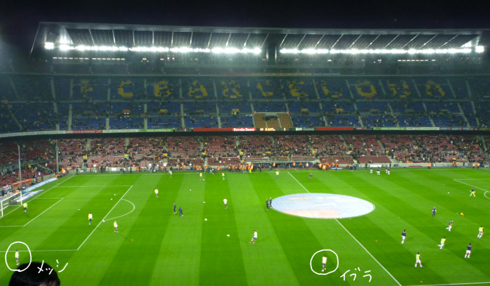
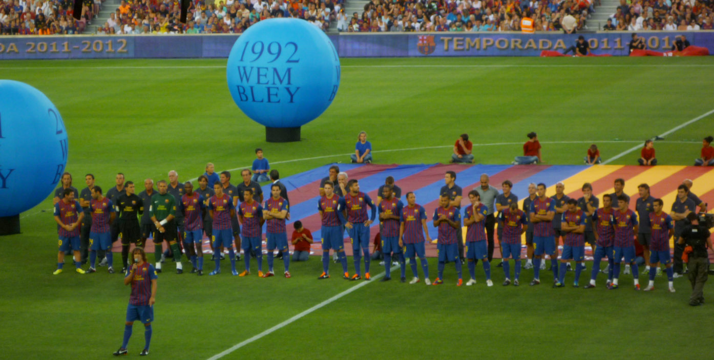
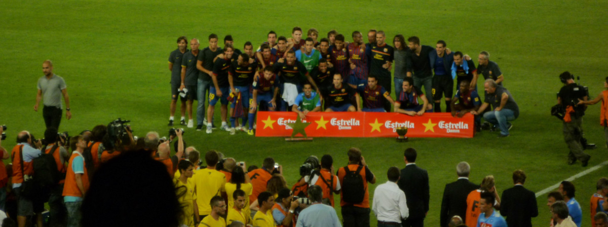

 
 

筆者を含む日本のサッカーファンがオリンピックの日本代表の試合に夢中になってた 3 日ほど前、突然、メッシのバルサ退団のニュースが世界中で報じられました。（正式には、メッシは６月末で契約が切れてます。）バルサの声明文やいくつかの記事を見たところ、リーガの定めるサラリーキャップのせいで再契約できなかったと書かれていました。以前から、このリーガのサラリーキャップて何なんだろうと思ってたので、ちょっと調べてました。

## **リーガのサラリーキャップ（el límite salarial）とは？**

リーガのサラリーキャップは、2013 年に、現リーガ会長であるテバスが会長に就任した際に導入されたもので、簡単に言うと、「選手の給料を含めた全ての費用を、収益の範囲内に収めなくてはならない」 というルールです。（個人的には、クラブを破産させないための至極真っ当なモノに思えます。）

具体的にどのような手続きで、各クラブに対しサラリーキャップが適用されるかを記します。各クラブはリーガに、4/30 までに次のシーズンの予算を提出します。そして、5 月の第３週以降に、リーガから各クラブに LCPD（Límite de coste de plantilla deportiva）なるものが与えられます。これは、選手、監督、コーチ、カンテラにかかる費用の合計額のリミットで、クラブはこの枠内にそれらの費用を収める必要があります。

ここ数年のバルサの LCPD の推移です。 
2018-2019 &emsp; 6 億 3290 万ユーロ 
2019-2020 &emsp; 6 億 7142 万ユーロ 
2020、夏 &emsp;&emsp; 3 億 8271 万ユーロ 
2020、冬 &emsp;&emsp; 3 億 4707 万ユーロ 
2021、夏 &emsp;&emsp; ??? 
 

2019-2020 シーズンの各チームの LCPD です。 

2020-2021 シーズンの各チームの LCPD です。バルサの下げ幅は他チームと比較してもダントツですね。 

<a href="https://www.laliga.com/transparencia/gestion-economica/limite-coste-plantilla" target="_blank"　rel="noopener noreferrer">引用元:LaLiga 公式サイト</a>
 
 

<a href="https://as.com/futbol/2021/08/06/primera/1628201317_861623.html" target="_blank"　rel="noopener noreferrer">AS 紙のこちらの記事</a>によると、メッシの再契約後の給料は、現状の 7100 万ユーロ(税込)の半額の 3500 万ユーロ(税込)となる予定だったそうです。しかし、それでも バルサは LCPD をクリアできず、再契約は結ばれない運びとなりました。

また、<a href="https://as.com/futbol/2021/08/06/primera/1628201317_861623.html" target="_blank"　rel="noopener noreferrer">同記事</a>には、他の選手の給料(税込)も書かれています。筆者は以下のとおりの感想を抱きました。 
「やっぱり攻撃の選手がたくさんもらうんだな。」 
「選手間にそこまで大きな給料差はないんだな。」 
「グリーズマンとコウチーニョとリキプッチは貰いすぎじゃないか。」 

そして、我ら同胞に非礼の限りを尽くしたデンベレと、その犬畜生にも劣る行為を笑って見ていたグリーズマンを追い出し、浮いたお金でメッシと契約してほしかったなとも思いました。（あの２人が出る試合は、おそらく楽しんで見れないと思うんですよね...）

 

## **どうしてバルサはコロナ禍のダメージが大きい？**

このコロナ禍において、世界中のクラブが経済的ダメージを負っていますが、とりわけバルサのダメージが特大だと言われています。筆者は、これは、バルセロナが過剰な観光都市であり、他のクラブと比べて観光客依存の収入が大きかったからじゃないかと思っています。（詳細にデータ等を見て分析したわけじゃありません、すいません。）

バルセロナは、コロナ禍前においては、ヨーロッパ No1 と言っても過言じゃないほどの観光都市でした。街のいたるところで観光客（とそれを狙うスリ）が溢れかえっていて、バルサにも大量のお金が落とされていました。

バルサの試合は、普通のリーグ戦の試合（レアルマドリー、アトレティコマドリー、バレンシア、セビージャ戦は除く）でも、少しいい席だと確か 150 ユーロくらいします。そして、好カードのリーグ戦やチャンピオンズリーグの試合なら、金額はもっと跳ね上がります。もちろん、この金額じゃ、地元の人たちは簡単に手が出ません。家族みんなで週末にカンプノウでサッカー観戦なんてことは、よほどの金持ちじゃないとできないと思います。しかし、生涯一度か二度のチャンスでバルセロナを訪れている観光客なら話は別です。バルセロナに観光に来るくらいの人なら、それくらいの金額は払っちゃうでしょうし、スタジアムに行ったら 150 ユーロくらいするユニフォームでも記念に買いたくなるものです。

筆者が観光客として初めてカンプノウを訪れた時の写真です。試合前のウォーミングアップで、メッシとイブラが凄まじいスピードのパス交換をしていました。
 
 

カンプノウは 10 万人弱を収容する巨大スタジアムです。コロナ禍により、この巨大な箱から得る実入りがゼロとなり、その結果、バルサは歴史上 No1 と言われる選手を失うこととなりました。今シーズンは、スタートから有観客での試合開催となりそうですが、おそらくキャパシティ制限のパーセンテージはコロコロ変わるでしょうし、何より、観光客がまだそこまで戻ってきてないバルセロナにおいては、スタジアム収入は依然厳しい状態が続くのではないでしょうか。

この記事を書いている 8/8(日) には、毎年恒例のプレシーズンマッチ Joan Gamper 杯が、※カンプノウにて 20,000 人の観客（キャパの 20%）を入れて行われます。この試合は、キャプテンが新シーズンの抱負をスタンドのクレに向かって語るのが通例となっていますが、メッシのそれを見れなくなるとは、ほんの数日前まで、ほとんどのクレが想像できなかったことでしょう。

※カンプノウじゃなく、ヨハンクライフスタジアム（Estadi Johan Cruyff）に変更されてました、すいません。 なお、観客はキャパの 50%の 3,000 人まで OK とのこと。
 
 

ちょうど 10 年前の Joan Gamper 杯です。試合前のキャプテン、プジョルの挨拶の場面です。（画質悪くてすいません。）
 

試合後の記念撮影の場面です。ガルディオラはどこに向かっているのでしょうか。（同じく画質悪くてすいません。）
