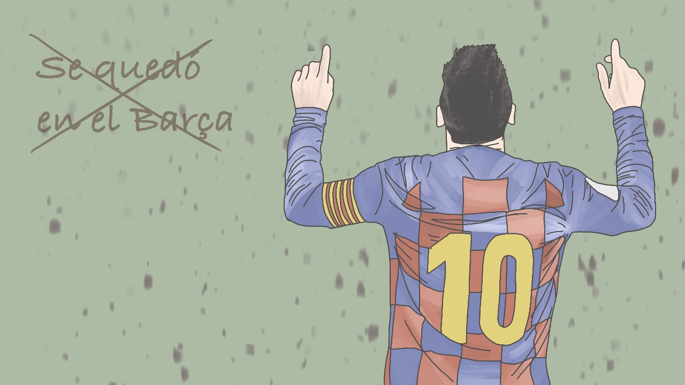
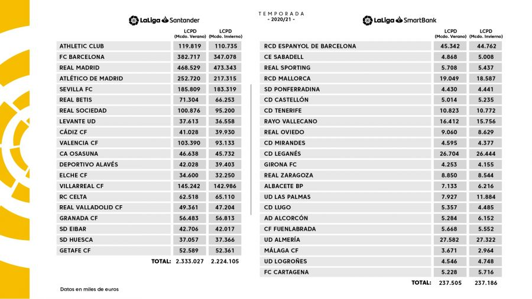
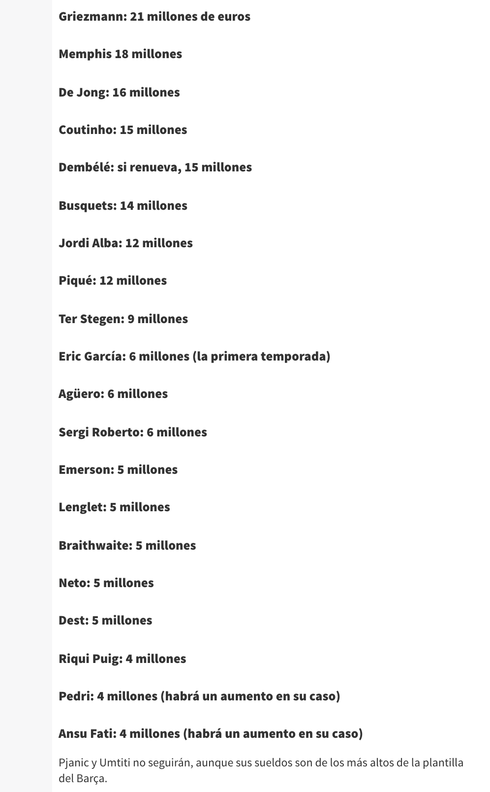

 
 

筆者を含む日本のサッカーファンがオリンピックの日本代表の試合に夢中になってた 3 日ほど前、突然、メッシのバルサ退団のニュースが世界中で報じられました。（正式には、メッシは６月末で契約が切れてます。）バルサの声明文やいくつかの記事を見たところ、リーガの定めるサラリーキャップのせいで再契約できなかったと書かれていました。以前から、このリーガのサラリーキャップて何なんだろうと思ってたので、ちょっと調べてました。

## **リーガのサラリーキャップ（el límite salarial）とは？**

リーガのサラリーキャップは、2013 年に、現リーガ会長であるテバスが会長に就任した際に導入されたもので、簡単に言うと、「選手の給料を含めた全ての費用を、収益の範囲内に収めなくてはならない」 というルールです。

具体的にどのような手続きで、各クラブに対しサラリーキャップが適用されるかを記します。各クラブはリーガに、4/30 までに次のシーズンの予算を提出します。そして、5 月の第３週以降に、リーガから各クラブに LCPD（Límite de coste de plantilla deportiva）なるものが与えられます。これは、選手、監督、コーチ、カンテラにかかる費用の合計額のリミットで、クラブはこの枠内にそれらの費用を収める必要があります。

ここ数年のバルサの LCPD の推移です。 
2018-2019 &emsp; 6 億 3290 万ユーロ 
2019-2020 &emsp; 6 億 7142 万ユーロ 
2020、夏 &emsp;&emsp; 3 億 8271 万ユーロ 
2020、冬 &emsp;&emsp; 3 億 4707 万ユーロ 
2021、夏 &emsp;&emsp; ??? 
 

2019-2020 シーズンの各チームの LCPD です。 

 

2020-2021 シーズンの各チームの LCPD です。バルサの下げ幅は他チームと比較してもダントツですね。 

<a href="https://www.laliga.com/transparencia/gestion-economica/limite-coste-plantilla" target="_blank"　rel="noopener noreferrer">引用元:LaLiga 公式サイト</a>
 
 

<a href="https://as.com/futbol/2021/08/06/primera/1628201317_861623.html" target="_blank"　rel="noopener noreferrer">As 紙のこちらの記事</a>によると、メッシの再契約後の給料は、現状の 7100 万ユーロ(税込)の半額の 3500 万ユーロ(税込)となる予定だったそうです。しかし、それでも バルサは LCPD をクリアできず、再契約は結ばれない運びとなりました。

また、<a href="https://as.com/futbol/2021/08/06/primera/1628201317_861623.html" target="_blank"　rel="noopener noreferrer">同記事</a>には、他の選手の給料(税込)も書かれているので、以下に引用します。 

<a href="https://www.laliga.com/transparencia/gestion-economica/limite-coste-plantilla" target="_blank"　rel="noopener noreferrer">引用元:As 紙「Los salarios de la plantilla del Barcelona: ¿quién es el mejor pagado tras la salida de Messi?（2021 年 8 月 6 日）」</a>
 
 

こうして給料一覧を見てみると、選手間でそこまで大きな差はないんだと思いました。また、個人的には、グリーズマンとリキプッチは貰いすぎじゃないかとも思いました。（実力に見合った額じゃないのかなと...） 

あと、我ら同胞に非礼の限りを尽くしたデンベレと、その無礼極まりない行為を笑って見ていたグリーズマンを追い出し、浮いたお金でメッシと契約してほしかったなとも思いました。（あの２人が出る試合は、おそらく楽しんで見れないと思うんですよね...）
