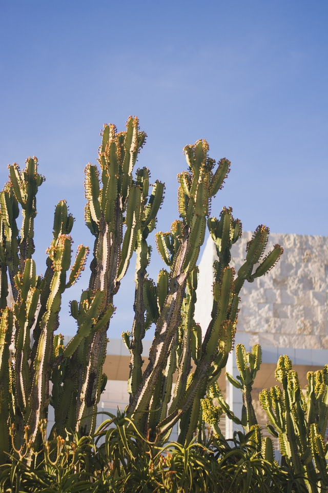

このブログは主にカタルーニャのことについて書いていこうと思ってますが、まずは、カタルーニャについて簡単に紹介してみたいと思います。

カタルーニャは、バルセロナを州都とするスペインの 1 つの州です。地中海に面し、北端にはフランスとの国境でもあるピレネー山脈があります。人口は東京の半分強の 750 万人ほど、面積は九州より少し小さい 32,000km2 ほどです。

カタルーニャは、かつてスペインとは別の国でした。中世には地中海沿いに一大国家を築き、君臨していた時代もあります。しかし、15 世紀の大航海時代の訪れとともに経済活動の中心が地中海から大西洋に移ったことで徐々に衰退していきます。そして、18 世紀初頭のスペイン継承戦争での敗北により、完全にスペインに併合されました。

以降は、いくつかのテーマに絞って、カタルーニャを紹介します。

サボテンです。

## カタルーニャ語

カタルーニャの公用語はカタルーニャ語とスペイン語と誰も使っていない Arán というマイナー言語です。バルセロナではたくさんのスペインや中南米からの流入者が多いので、スペイン語をよく聞きますが、バルセロナ以外では、ほぼカタルーニャ語が使われています。小中高の授業もカタルーニャ語で行われていますし、公共交通機関の放送もカタルーニャ語です。

そんなカタルーニャ語ですが、現在、消滅の危機に立たされていると言われています。これまで、たくさんの少数言語が大きな言語に呑み込まれていった歴史と同様、スペイン語に取って代わられる危機をカタルーニャの人々は感じています。実際、若い世代の多くは、昔からのカタルーニャ語ではなく、スペイン語化されたカタルーニャ語を話しています。

## バルセロナ

バルセロナに住んで思うのは、まずは、観光客の多さです。東京と比べてみると街自体がそんなに大きくないので、どこもかしこも観光客で溢れています。（2021 年 7 月現在、ヨーロッパからの観光客を中心に、徐々に客足が戻りつつあります。）確かに町には豊富な観光資源があると思います。サグラダファミリアを代表とする Modernisme(19 世紀末に起こったカタルーニャ版ルネッサンス)の建築が至る所にありますし、FC Barcelona のような世界的に人気なサッカーチームもその 1 つでしょう。
現在のようなヨーロッパ有数の観光地になったきっかけとなったのは、1992 年に開催された夏季オリンピックです。火矢で聖火台に点火し、開会式のマスゲームで「 El Mar Mediterrani 」を坂本龍一が指揮したあの大会です。（本当は、火矢は聖火台を大きく外れていますが...）生まれてから 60 年以上ずっとバルセロナに住み続けている知人は、静かだった街が、オリンピックの開催をきっかけに、急速に、国際化・観光化していったと言っていました。

## Barça

Barça（バルサ）は世界的人気のあるサッカーチーム、「 Futbol Club Barcelona 」のことです。「 MÉS QUE UN CLUB (1 つのクラブ以上の存在) 」というスローガンを掲げ、カタルーニャのシンボル的存在になっています。（筆者の周りはサッカーやバルサを毛嫌いする人が多いですが...）
1988 年に監督に就任したオランダ人のヨハン・クライフのサッカー哲学「ボールを繋ぎ、試合を支配したうえで勝利する」を現在においても標榜するクラブであり、そのサッカースタイルは日本においても大変人気があります。ただ、現在においては、前経営陣によるずさんな運営とコロナ禍による経済的打撃により、財政的にかなり逼迫しているようで、チャンピオンズリーグ優勝を狙えるような以前の強さはありません。

## 独立運動

カタルーニャは、スペインに併合されて以降、幾度となく独立の気運が高まることがありましたが、スペインに組み込まれて 300 年経過した現代においては、独立を求める声は少数派になっていました。しかし、2006 年に制定されたカタルーニャ自治憲章を、時のスペイン与党が違憲であると憲法裁判所に提訴しました。なんでも、「カタルーニャは nació（英語の nation。≒ 国家、民族の共同体）である。」の一文を PP は問題視したそうです。そして、2010 年に違憲である判決が下されたことをきっかけに、独立派が急激に増加していき、約半数を占めるまでに至りました。
そして、2017 年 10 月にカタルーニャ州政府は、独立するかどうかの住民投票を行いました。これは、スペイン政府非公認のもので、投票日当日には、スペインの警察であり軍隊でもある Guardia Civil によって暴力を伴った妨害がありました。2017 年 12 月には、投票結果に基づき、カタルーニャ州議会は独立宣言を可決し、カタルーニャの独立が宣言されたことになりましたが、結局はスペインに力でねじ伏せられ、独立は無かったことになりました。そして、独立指導者、独立派の政治家は逮捕されるか国外に逃げました。あれから３年以上が経過し、現在は独立を求める大きな波はもう起こってないです。おそらく、多くの独立支持者が、独立は現実的なものではないと諦めたのだと思います。筆者は、ここ近年の独立運動の最中にいました。外国人という中立的な立場の下、賛成派、反対派、中立派、カタルーニャ人、スペイン人と話をしてきました。いずれ、この件についても、記事を書いてみたいと思います。

([Wikipedia Link](https://en.wikipedia.org/wiki/Salted_duck_egg))
