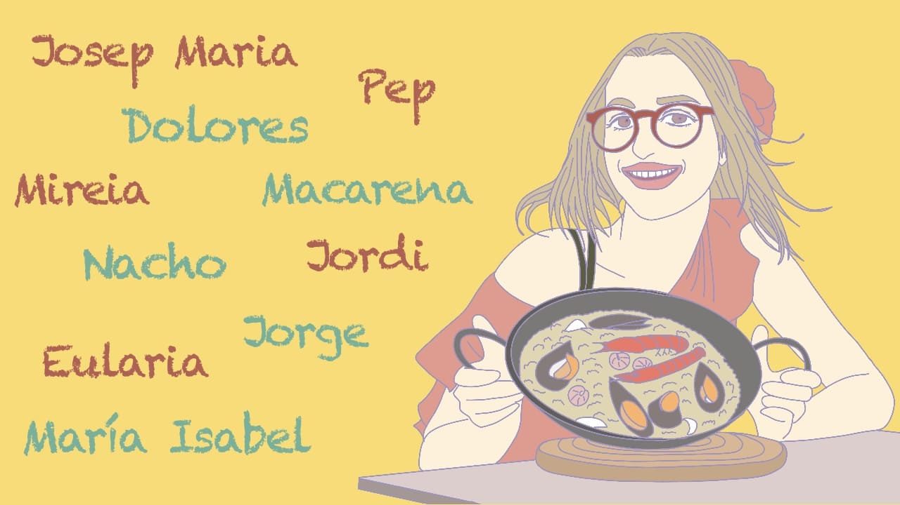

 

カタルーニャ語とスペイン語を学ぶにつれ、２つの言葉の名前についても色々とわかるようになってきました。例えば、カタルーニャ語の「ジョルディ」という名前は、スペイン語だと「ホルヘ」となります。

今回は、この 2 つの言語の名前について書いてみました。名前の具体例はサッカー選手を多用しているので、リーガ好きな人にも読んでほしく思います。

## **名前の基本の形 「 名前 + 名字１ + 名字２ 」**

まずは、カタルーニャ人とスペイン人の名前の基本の形です。「 名前 + 名字１ + 名字２ 」となります。2 つの名字を持つのが特徴です。

<table>
<tr><td bgcolor=#87A59C><b>① Joan Laporta Estruch</b> 
　ジュアン・ラポルタ・アストゥルチ 
（バルサの会長、カタルーニャ人）
<tr><td bgcolor=#87A59C><b>② Ada Colau Ballano</b> 
　アダ・コラウ・バヤノ 
（バルセロナの名物女性市長、カタルーニャ人）
<tr><td bgcolor=#87A59C><b>③ Florentino Pérez Rodríguez</b> 
　フロレンティーノ・ペレス・ロドリゲス 
（レアルマドリーの会長、スペイン人）
</table>

 

①Joan Laporta Estruch の場合は、Joan が「名前」、Laporta が「名字１」、Estruch が「名字２」です。

「名字１」は父親から受け継いだもので、「名字２」は母親から受け継いだものです。

例えば、①Joan Laporta Estruch と ②Ada Colau Ballano が結婚して Jordi という名の息子が誕生したとしましょう。Jordi の名字は Laporta Colau となります。

 

<table>
<tr><td bgcolor=#AA9D92>Joan Laporta Estruch（父）
<tr><td bgcolor=#AA9D92>Ada Colau Ballano（母）
<tr><td bgcolor=#AA9D92>Jordi Laporta Colau（子）
</table>

 

子は、父と母の「名字１」を受け継ぎます。父の「名字１」が先にきて、母の「名字１」が後に続きます。

上の表を見てもわかるとおり、このシステムでは、父、母、子、それぞれで名字が異なります。また、結婚しても離婚しても名字が変わることはありません。

 

## **カタルーニャ語とスペイン語の名前**

 

<table>
<tr><th bgcolor=#B3A946> カタルーニャ語         <th bgcolor=#B3A946> スペイン語 
<tr><td bgcolor=#B3A946> Andreu(アンドレウ)   <td bgcolor=#B3A946>　Andrés(アンドレス)
<tr><td bgcolor=#B3A946>Andrea(アンドレア)     <td bgcolor=#B3A946>　Andrea(アンドレア) 
<tr><td bgcolor=#B3A946> Carles(カルラス)     <td bgcolor=#B3A946>　Carlos(カルロス)  
<tr><td bgcolor=#B3A946> Dolors(ドロルス)     <td bgcolor=#B3A946>　Dolores(ドロレス)  
<tr><td bgcolor=#B3A946> Enric(アンリック)   <td bgcolor=#B3A946>　Enrique(エンリケ) 
<tr><td bgcolor=#B3A946> Ferran(ファラン)    <td bgcolor=#B3A946>　Fernando(フェルナンド) 
<tr><td bgcolor=#B3A946> Gerard(ジェラール)  <td bgcolor=#B3A946>　Gerardo(ヘラルド)
<tr><td bgcolor=#B3A946> Jaume(ジャウマ)     <td bgcolor=#B3A946>　Jaime(ハイメ)    
<tr><td bgcolor=#B3A946> Joaquim(ジュアキム) <td bgcolor=#B3A946>　Joaquín(ホアキン)
<tr><td bgcolor=#B3A946> Jordi(ジョルディ)   <td bgcolor=#B3A946>　Jorge(ホルヘ)
<tr><td bgcolor=#B3A946> Josep(ジュゼップ)   <td bgcolor=#B3A946>　José(ホセ)
<tr><td bgcolor=#B3A946> Josepa(ジュゼパ)    <td bgcolor=#B3A946>　Josefa(ホセファ)
<tr><td bgcolor=#B3A946> Joan(ジュアン)      <td bgcolor=#B3A946>　Juan(フアン) 
<tr><td bgcolor=#B3A946> Joana(ジュアナ)     <td bgcolor=#B3A946>　Juana(フアナ)
<tr><td bgcolor=#B3A946> Marc(マルク)        <td bgcolor=#B3A946>　Marco(マルコ)
<tr><td bgcolor=#B3A946> Marta(マルタ)     <td bgcolor=#B3A946>　Marta(マルタ)

<tr><td bgcolor=#B3A946> Mateu(マテウ)       <td bgcolor=#B3A946>　Mateo(マテオ)
<tr><td bgcolor=#B3A946>  Pau(パウ)           <td bgcolor=#B3A946>　Pablo(パブロ)
<tr><td bgcolor=#B3A946> Pere(ペラ)          <td bgcolor=#B3A946>　Pedro(ペドロ)
<tr><td bgcolor=#B3A946> Sergi(セルジ)       <td bgcolor=#B3A946>　Sergio(セルヒオ)
<tr><td bgcolor=#B3A946> Xavier(シャビエル)  <td bgcolor=#B3A946>　Javier(ハビエル) 
</table>
※白は男性、茶色は女性の名前です。

 
 

上の表は、カタルーニャ語とスペイン語の名前を比較したもの（の一例）です。例えば、スペイン語の「Sergio（セルヒオ）」は、カタルーニャ語だと「Sergi（セルジ）」となります。

<figcaption>実は同じ名前のこの２人。セルジ・ロベルト と セルヒオ・ラモス。</figcaption>

<a href="http://www.gettyimages.co.jp/detail/1189433774" target="_blank" style="color:#a7a7a7;text-decoration:none;font-weight:normal !important;border:none;display:inline-block;">Embed from Getty Images</a>

<iframe src="//embed.gettyimages.com/embed/1189433774?et=UmMte3vaRGlbQJZhUPbo6Q&tld=co.jp&sig=5cwehrPclndG4XoY3FSECt4hdA0-NLQRDqRoCTwqh7Q=&caption=true&ver=1" scrolling="no" frameborder="0" width="594" height="396" style="display:inline-block;position:absolute;top:0;left:0;width:100%;height:100%;margin:0;"></iframe>

「Andrea（アンドレア）」や「Marta（マルタ）」は、両言語共通で使われる名前です。

「Andreu（アンドレウ）」および「Andrés（アンドレス）」と「Andrea（アンドレア）」は、「俊夫」と「俊子」のような、男版と女版の名前になります。

バルサが好きな人なら、上の表を見て、「カルラス・プジョール」、「ジェラール・ピケ」、「ジョルディ・アルバ」、「ジュゼップ・ガルディオラ」、「マルク・ククレジャ」、「セルジ・ロベルト」、「シャビエル・エルナンデス」などが頭に浮かぶのではないでしょうか。彼らは全員カタルーニャ人で、カタルーニャ語の名前を持ちます。

また、カタルーニャ人でない、ビジャレアルの「パウ・トーレス」や マンチェスターシティの「フェラン・トーレス※1」もカタルーニャ語の名を持っているとわかります。彼らは、バレンシア州出身で、バレンシア州でもカタルーニャ語が使われている※2からです。

※1、 表には「Ferran(ファラン)」と書いてありますが、バレンシア州での発音では「Ferran(フェラン)」となります。 
※2、 バレンシアの人々は、自分たちの話している言語はカタルーニャ語ではなく、独自の言語であるバレンシア語だと主張しています。

上記の表の名前のほとんどは、聖書の登場人物である sant（サン、カタルーニャ語）の名前です。現在はカタルーニャやスペインでもキラキラネーム的な名前が流行ってますが、昔は、ほとんどの人が sant から採った名前を子に付けていたそうです。

なお、Francisco Franco(フランシスコ・フランコ)の独裁体制下(1939 − 1975)では、sant 以外の名前を子に付けることは禁止されていました。また、その時代は、公の場でのカタルーニャ語の使用も禁止されており、当然、カタルーニャ語の名前を付けることも禁止されていました。

筆者の知り合いのカタルーニャ人に Josepa(ジュゼパ) さんという方がいます。彼女はフランコ独裁体制下に生まれ、昔はスペイン語の名前の Josefa(ホセファ) さんだったのですが、フランコが死んでカタルーニャ語の名前が解禁となった際
に、カタルーニャ語の Josepa(ジュゼパ) に改名したそうです。

カタルーニャ人やスペイン人には、いわゆる、ミドルーネームのある複合的な名前を持つ人がいます。例えば、現スペイン代表監督の、Luis Enrique（ルイス・エンリケ）がそうです。

彼の本名は Luis Enrique Martínez García です。これを分解すると、Luis Enrique が「名前」、Martínez が「名字１」、García が「名字２」となります。

よくある複合的な名前として、「José María(ホセ・マリア、スペイン語)」「María José(マリア・ホセ、スペイン語)」「Ana Maria(アナ・マリア、カタルーニャ語)」「María Isabel(マリア・イザベル、スペイン語)」などがあります。なお、「José María(ホセ・マリア)」は男性の名前で、「María José(マリア・ホセ)」は女性の名前です。

 

<figcaption>バルサの前会長、 Josep Maria Bartomeu i Floreta。彼の名前の Josep Maria（ジュゼップ・マリア） も「複合的な名前」です。</figcaption>

<a href="http://www.gettyimages.co.jp/detail/1228108900" target="_blank" style="color:#a7a7a7;text-decoration:none;font-weight:normal !important;border:none;display:inline-block;">Embed from Getty Images</a>

<iframe src="//embed.gettyimages.com/embed/1228108900?et=1fc6CLm0SX1DolUrBlWsfA&tld=co.jp&sig=tEDNZTEc_fjmqStsNmv0DyKEfdD-8kHk48mz5Rcoxww=&caption=false&ver=1" scrolling="no" frameborder="0" width="594" height="395" style="display:inline-block;position:absolute;top:0;left:0;width:100%;height:100%;margin:0;"></iframe>

## **apodo(あだ名・愛称)**

カタルーニャ語とスペイン語の名前の中には、apodo という定番のあだ名が存在するものがあります。有名なのは、現マンチェスターシティ監督の「ジュゼップ・ガルディオラ」の、 Josep(ジュゼップ) に対する Pep(ペップ) です。

 

<table>
<tr><th bgcolor=#D55558>apodo(あだ名・愛称)<th bgcolor=#D55558>名前 
<tr><td bgcolor=#FB888B>Pep(ペップ)　 <td bgcolor=#FB888B>Josep(ジュゼップ)
<tr><td bgcolor=#FB888B>Pepe(ぺぺ)　 <td bgcolor=#FB888B>José(ホセ)
<tr><td bgcolor=#FB888B>Pepa(ペパ)　 <td bgcolor=#FB888B>Josepa(ジュゼパ)
<tr><td bgcolor=#D55558>Pepa(ペパ)　 <td bgcolor=#D55558>Josefa(ホセファ)
<tr><td bgcolor=#D55558>Lola(ロラ)　 <td bgcolor=#D55558>Dolores(ドロレス)
<tr><td bgcolor=#D55558>Nacho(ナチョ)　 <td bgcolor=#D55558>Ignacio(イグナシオ)
<tr><td bgcolor=#D55558>Rafa(ラファ)　 <td bgcolor=#D55558>Rafael(ラファエル)
<tr><td bgcolor=#D55558>Quique(キケ)　 <td bgcolor=#D55558>Enrique(エンリケ)
<tr><td bgcolor=#D55558>Beto(ベト)　 <td bgcolor=#D55558>Roberto(ロベルト)
<tr><td bgcolor=#FB888B>Toni(トニ)　 <td bgcolor=#FB888B>Antoni(アントニ)
<tr><td bgcolor=#D55558>Toño(トニョ)　 <td bgcolor=#D55558>Antonio(アントニオ)
<tr><td bgcolor=#D55558>Rico(リコ)　 <td bgcolor=#D55558>Ricardo(リカルド)
<tr><td bgcolor=#D55558>Chema(チェマ)　 <td bgcolor=#D55558>José María(ホセ・マリア)
<tr><td bgcolor=#D55558>Maite(マイテ)　 <td bgcolor=#D55558>María Teresa(マリア・テレサ)
<tr><td bgcolor=#D55558>Maribel(マリベル)　 <td bgcolor=#D55558>María Isabel(マリア・イザベル)
<tr><td bgcolor=#D55558>Paco(パコ) Pancho(パンチョ)　 <td bgcolor=#D55558>Francisco(フランシスコ)
<tr><td bgcolor=#FB888B>Laia(ライア) <td bgcolor=#FB888B>Eularia(アウラリア)
</table>
※濃いピンクはカタルーニャ語、薄いピンクはスペイン語です。白は男性の名前で、黄色は女性の名前です。

上の表は、apodo の一例です。レアルマドリーの「ナチョ」、ビジャレアルの「パコ・アルカセル」、先日セビージャに移籍した「ラファ・ミル」、元リバプールの GK の「ぺぺ・レイナ」などは、登録名に apodo が使われています。

 

## **Sánchez は Sancho の息子**

スペイン語の名字は色々な由来があります。例えば、「Molinero（小麦粉作る人）」は職業、「Sevillano（セビージャの人）」は地名、「Delgado（痩せている）」は体の特徴から来ています。

その中でも一番よくあるパターンは、語尾に「〜の息子」を意味する「ez」が付く形です。例えば、「Sánchez（サンチェス）」という名字は、「Sancho(サンチョ)の息子」を意味します。

<table>
<tr><th bgcolor=#79A8C7>名前<th bgcolor=#79A8C7>名字 「 〜ez (〜の息子) 」
<tr><td bgcolor=#70A0BF>Sancho(サンチョ)　 <td bgcolor=#70A0BF>Sánchez(サンチェス)
<tr><td bgcolor=#70A0BF>Fernando(フェルナンド)　 <td bgcolor=#70A0BF>Fernández(フェルナンデス)
<tr><td bgcolor=#70A0BF>Rodrigo(ロドリゴ)　 <td bgcolor=#70A0BF>Rodríguez(ロドリゲス)
<tr><td bgcolor=#70A0BF>Martín(マルティン)　 <td bgcolor=#70A0BF>Martínez(マルチネス)
<tr><td bgcolor=#70A0BF>Lope(ロペ)　 <td bgcolor=#70A0BF>López(ロペス)
<tr><td bgcolor=#70A0BF>Gonzalo(ゴンサロ)　 <td bgcolor=#70A0BF>González(ゴンサレス)
</table>

Fernández(フェルナンデス)なら Fernando(フェルナンド)の息子、Rodríguez(ロドリゲス)なら Rodrigo(ロドリゴ)の息子、González(ゴンサレス)なら Gonzalo(ゴンサロ)の息子を意味します。

<figcaption>ラウールはイグアインの息子？（若き日の Raúl González と Gonzalo Higuaín)
</figcaption>

<a href="http://www.gettyimages.co.jp/detail/86226414" target="_blank" style="color:#a7a7a7;text-decoration:none;font-weight:normal !important;border:none;display:inline-block;">Embed from Getty Images</a>

<iframe src="//embed.gettyimages.com/embed/86226414?et=tPmofMT1TAZKOSxtDnLucA&tld=co.jp&sig=63sDRJBx221CxmGWZq3T9v-sfYW89E7l7ITTCp2bMO4=&caption=false&ver=1" scrolling="no" frameborder="0" width="594" height="463" style="display:inline-block;position:absolute;top:0;left:0;width:100%;height:100%;margin:0;"></iframe>

最後に余談を少し... こちらに住む中国の人は、イングリッシュネームなるものを持っていて、各人が自由に西洋風の名前を名乗っています。以前、知り合いのカタルーニャ人に、「私もこれから中国の人たちをまねして、セルヒオとでも名乗ってみようかな。」と言ったら、「あなたの顔はセルヒオじゃない。やめた方がいい。」と言われました。

確かに私は凹凸のあまりない平たい顔で、大きさもこちらの人の 1.2 倍ほどあるでしょうか。セルヒオっぽい顔とは程遠いことでしょう。しかし、セルヒオっぽい顔ってどんななんでしょう。PSG に移籍した元レアルマドリーのキャプテンみたいな顔でしょうか。ちょっと気になります。
