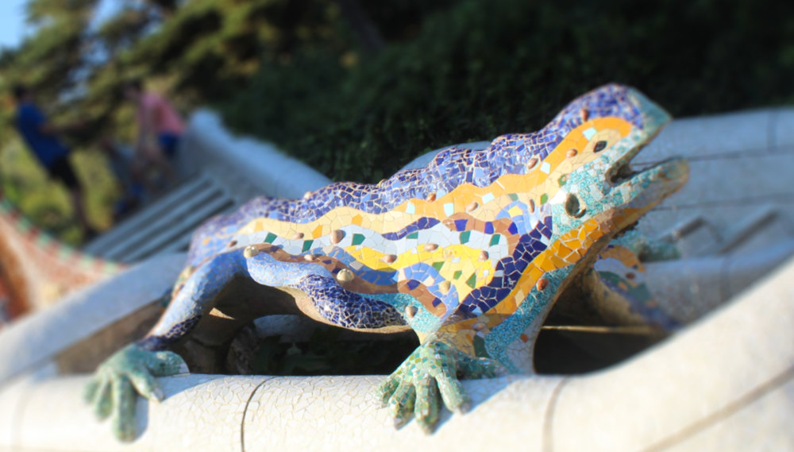
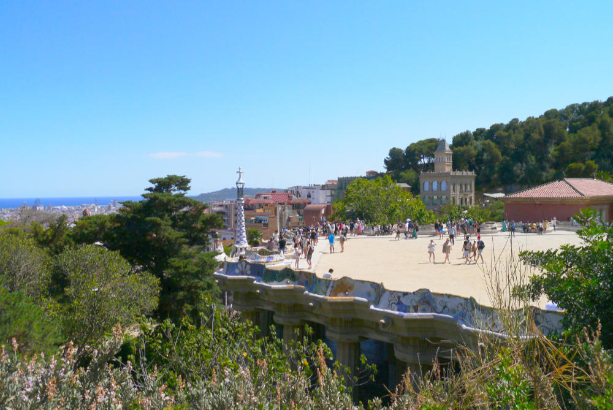
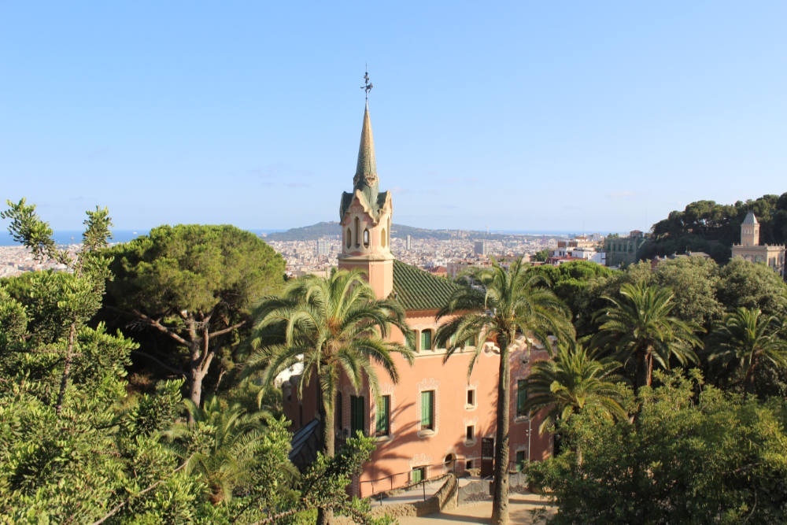
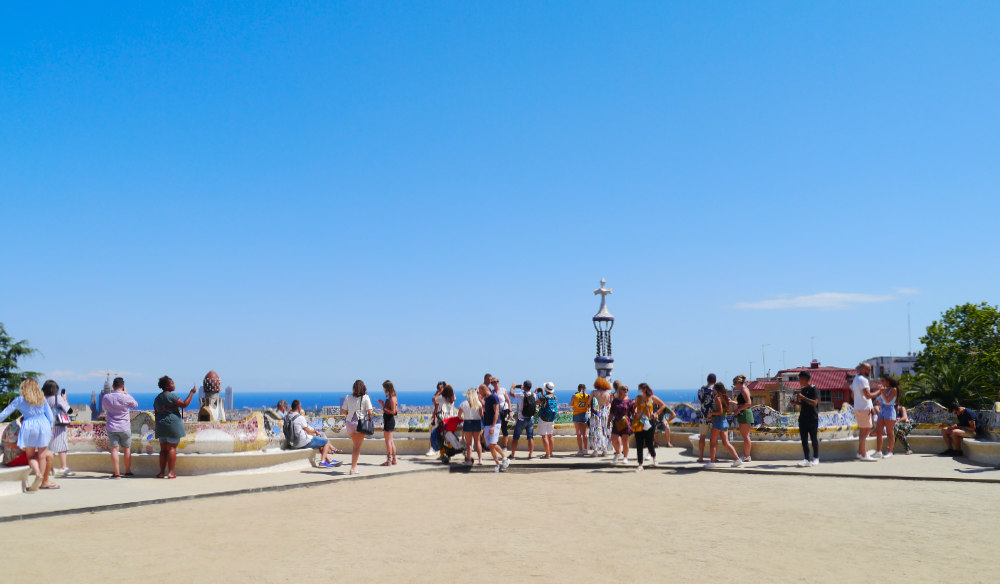
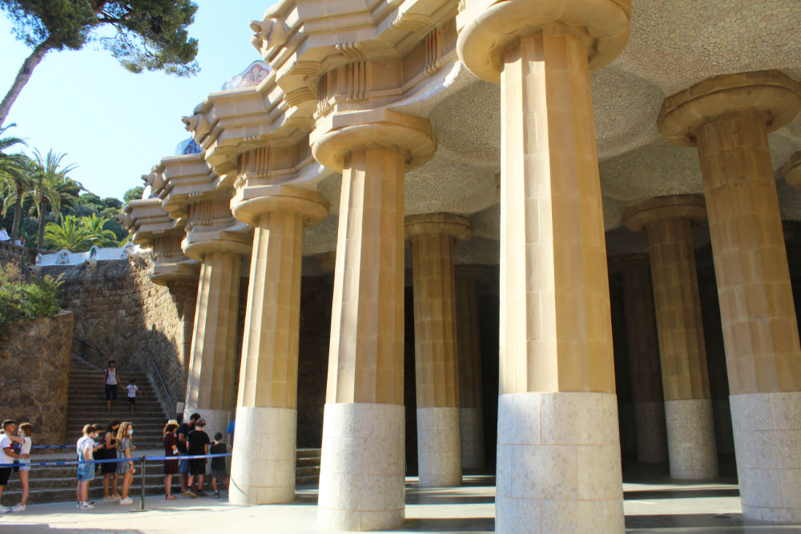
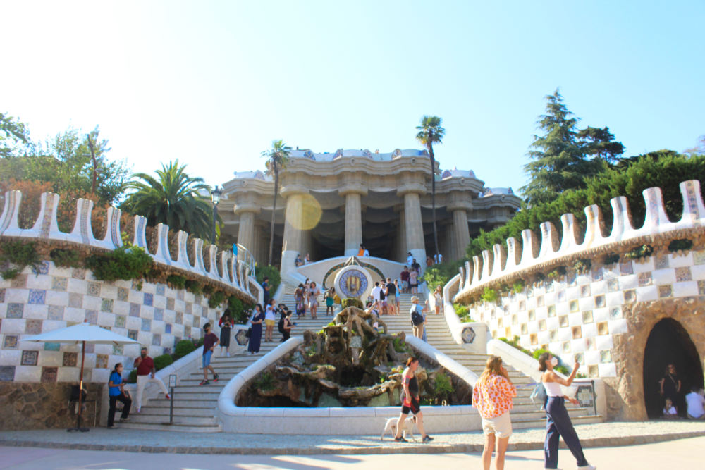
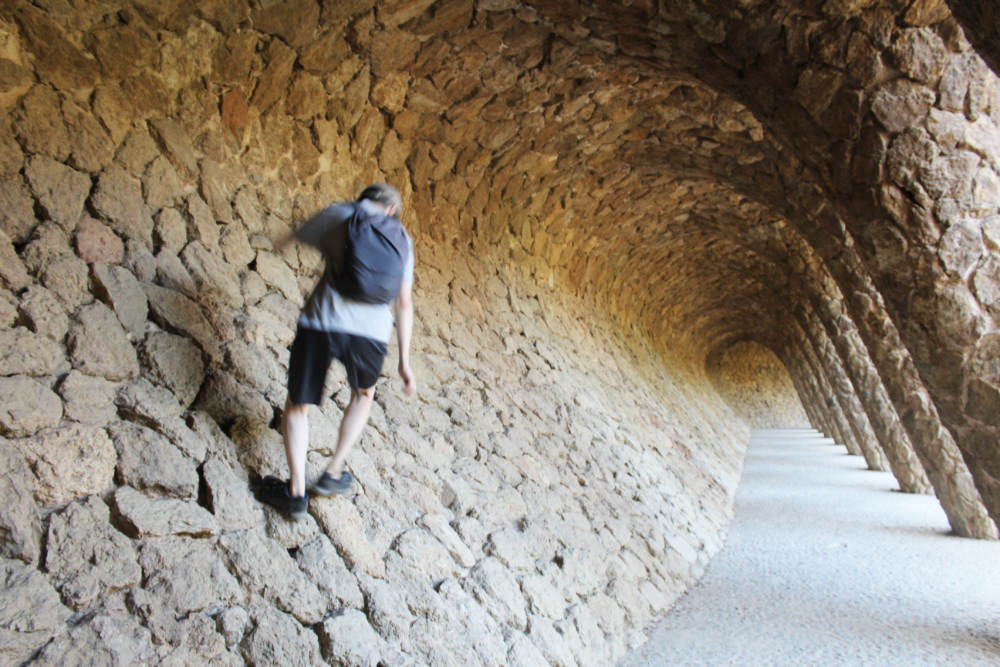

先日、観光スポットとしても有名なグエル公園（Park Güell、パーク グエィ）まで散歩してきました。7 月になり、ヨーロッパのバカンスの時期に入ったこともあり、けっこうな数の観光客がいました。

公園のシンボル的存在のカラフルなタイルのトカゲです。
 
 

グエル公園は、当初、公園ではなく 60 区画の住宅地をつくる予定だったようです。街と地中海が一望できる住宅をつくれば売れるだろうというアイデアでしょう。しかし、建設予定地は、丘というか山の中であり、大変厳しい条件の下での施工となりました。また、施工開始後、期待していたような景観が望め、かつ、近隣の日陰とならない住宅は 10/60 戸ほどしかつくることができないとわかりました。

こうしたことを受け、施主の Eusebi Güell（エウゼビ グエィ）は、住宅地からイギリス風の公園へとプラン変更を思い描いていたようです。

グエィはこんな景色を持つ住宅地をつくろうとしていたようです。
 

グエル公園は、1900 年に建設が始まりました。当時のバルセロナは、「 El modernisme català 」と呼ばれる、芸術のムーブメントが起こっており、街には、Casa Milà（カザ ミラ）、 Casa Batlló（カザ バヨ）、 Hospital de Sant Pau（ウスピタル ダ サンパウ）といった「modernisme 様式の建築」がどんどんつくられていきました。グエル公園の設計者は、この時代の代表的建築家である Antoni Gaudí（アントニ ガウディ）です。

グエィとガウディの出会いは、1878 年のパリの博覧会です。グエィが、ガウディのデザインしたショーケースを見て、彼のアーティストとしての実力に惚れ込んだようです。以降、資産家のグエィは、ガウディに数々の設計を依頼します。グエィとガウディは、顧客と建築家という関係だけでなく、プライベートな時間を共有するほどの仲だったそうです。

 
 

1914 年、上の写真にあるタイルのベンチで覆われた広場が完成しました。しかし、同年、購入者不足のため、工事は中断されました。60 戸を予定していた住宅は、結局、２戸しか建設されず、1 つはグエィの友人が購入したもので、もう１つは、購買促進のための展示住宅というありさまでした。こうして、計画は失敗に終わり、素晴らしい景観を持つ住宅地となるはずだった土地は、グエィ個人の広大な庭となりました。

展示住宅だった建物です。のちにガウディが住み、現在はミュージアムになっています。
 
 

グエィは 1918 年、グエル公園内の自分の家で亡くなりました。この家は、彼が土地を購入した時にすでにあった旧家の邸宅で、工事中にそこに引っ越していました。そして、彼の相続者は、バルセロナ市にグエル公園の売却を持ちかけ、1922 年に売買契約が締結し、1926 年に公園としてオープンされました。

グエィの家です。現在は保育園兼小学校になっています。

 
 

メインの広場のカラフルなタイルでできたベンチです。バカンスシーズン前の 6 月までは、いつ来てもほぼ貸切状態だったのですが、現在はかなり観光客が戻ってきました。（と言っても、コロナ禍前の２、３割ほどでしょう。アジアからの観光客はまだ見かけませんし。）

 
 

メイン広場の下は、ピロティになっています。支柱がごついです。
 
 

ピロティの天井も、タイルで装飾されています。
 
 

正面入り口から撮った写真です。
 
 

こんな通路もあります。
 
 
